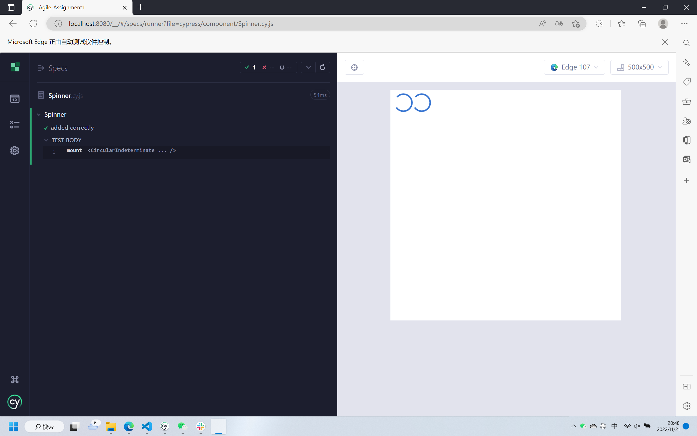
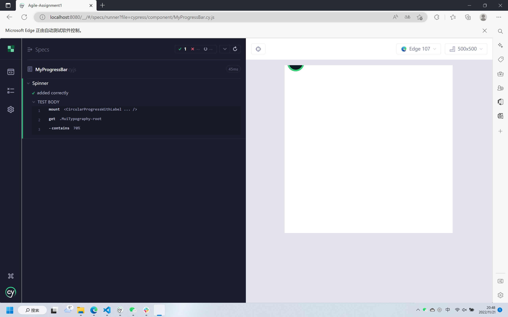

# Assignment 1 - Agile Software Practice.

__Name:__ Luo Yang

This repository contains the implementation of a React App and its associated Cypress tests and GitLab CI pipeline.

Gitlab Link: https://gitlab.com/20099902/agile-assignment1
## React App Features.
 
+ New moive page - Top rated moives
+ New people page - Popular people
+ New people details page - Person details
+ New site header (Drop-down Menu)
+ Sorting (14 sorting options) on discover page
+ New movie rating for movie card
+ User can click the link on person details page to reach the movie details page.
+ Pagination on Top rated movies page and Upcoming movies page.
+ New discover page - Infinite scroll
+ New filters - Runtime filter and Rating filter.
+ Firebase Authentication - Login, register, reset password.

## Automated Tests.

### Best test cases.

+ cypress/e2e/filtering.cy.js
+ cypress/e2e/people.cy.js

### Cypress Custom commands (if relevant).

+ cypress/e2e/login.cy.js

## Code Splitting.

+ src/index.js

## Pull Requests.

https://github.com/luoyangyuli2001/Agile-assignment1

## Independent learning (If relevant).

### Auto Deployment on Github

https://luoyangyuli2001.github.io/Agile-assignment1

### Component Tests

